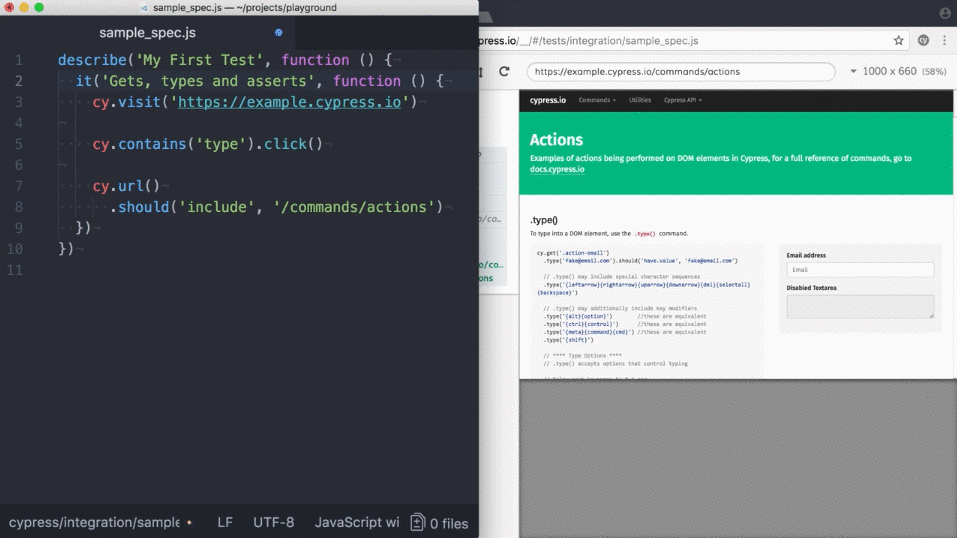

<div align="center">
  
  # 🏆 QA Portfolio — Silmara Costa
  
  <!-- GIF Principal vindo do seu repositório -->
  

  <p align="center">
    <strong>QA Automation Engineer | Manual & Functional Testing | CI/CD Pipelines</strong>
  </p>

  ### 🛠️ Core Tech Stack
  ⚡ **Cypress** • 🧪 **Playwright** • 🎯 **Postman** • 🗄️ **MySQL** • ⚙️ **GitHub Actions**
</div>

---


## 🎯 About the Portfolio
This repository centralizes my entire software quality assurance (QA) journey and evolution. Listed below are all my **21 hands-on projects**, covering everything from complex test automation with CI/CD pipelines to manual exploratory testing in real-world scenarios.

---

## 🛠️ Technical Skills

*   **Automated Testing:** Web UI Automation (Cypress & Playwright), API Testing, and Database Testing.
*   **DevSecOps & CI/CD:** Automated pipeline orchestration via GitHub Actions (DAST, API, and Web).
*   **Manual Testing:** Functional, Exploratory, Regression, Usability Testing, and Test Case Writing.
*   **Database Validation:** Structured SQL querying, data validation, and manipulation using MySQL.

---

## 💻 All Projects

### 🤖 1. Web UI & Regression Automation (E2E)

| Repository | Technical Description | Stack / Tools |
| :--- | :--- | :--- |
| **[cypress-form-submission-test]()** | End-to-end web form submission automation, validating system responses and error boundaries. | Cypress / JavaScript |
| **[multi-framework-web-api-automation]()** | Framework architecture handling both Web UI tests and API integrations within the same workspace. | Cypress / Playwright |
| **[qa-cypress-basic-navigation-test]()** | Smoke test suite automating route validation, broken links verification, and UI element rendering. | Cypress / JavaScript |
| **[suite-de-automatizacion-web-api]()** | Comprehensive test suite combining end-to-end user journeys across both the interface and API layers. | Cypress / JavaScript |

### 🔌 2. API Testing & Endpoint Validation

| Repository | Technical Description | Stack / Tools |
| :--- | :--- | :--- |
| **[API-Testing-Project]()** | Test collections for HTTP requests featuring automated status assertions and JSON Schema validation. | Postman / Newman |
| **[Projeto_API_FakeStore]()** | Complete backend automation for a simulated e-commerce, covering cart flows, product catalog, and auth. | Postman |

### ⚙️ 3. CI/CD Pipelines & DevSecOps (GitHub Actions)

| Repository | Technical Description | Tools |
| :--- | :--- | :--- |
| **[api-automation-pipeline-qa]()** | Automated pipeline triggering API contract and integration test execution on every repository commit. | GitHub Actions / Postman |
| **[devsecops-api-dast-pipeline]()** | Security-focused pipeline (DevSecOps) running Dynamic Application Security Testing (DAST) to find API flaws. | GitHub Actions / DAST |
| **[pipeline-automatizacion-api-qa]()** | Continuous Integration workflow configured to run headless regression testing suites in the cloud environment. | GitHub Actions |
| **[pipeline-devsecops-api-dast]()** | Pipeline architecture integrating dynamic security scanning tailored for web application delivery streams. | GitHub Actions / Security |

### 🗄️ 4. Database & Backend Testing

| Repository | Technical Description | Technologies |
| :--- | :--- | :--- |
| **[automatizacion-playwright-mysql]()** | Automated scripts built for complex workflow assertions, integrating test data generation through DB queries. | Playwright / MySQL |
| **[database-testing-playwright-mysql]()** | Direct DB connection setup to validate data persistence, integrity, and backend updates triggered by UI actions. | Playwright / MySQL |

### 🔍 5. Manual, Functional & Exploratory Testing

| Repository | Validation Scope | Test Target |
| :--- | :--- | :--- |
| **[Projeto_Bug_Amazon_Filtros]()** | Structured exploratory testing focused on breaking and exposing flaws in the advanced search filtering algorithm. | Amazon Web |
| **[Projeto_Busca_Shopee]()** | Mapping positive and negative E2E scenarios for product search, dynamic filtering, and results pagination. | Shopee App/Web |
| **[Projeto_CT_Digital]()** | Meticulous manual analysis and security validation of the authentication and token workflow on the Digital Work Card. | Government Platform |
| **[Projeto_Carrinho_Amazon]()** | Manual validation of critical business rules: item quantity updates, deletion persistence, and shipping/subtotal recalculation. | Amazon Cart |
| **[Projeto_Login_Amazon]()** | Functional test cases covering critical paths: authentication, password recovery, and error boundary handling. | Amazon Login |
| **[Projeto_Mercado_Livre]()** | Exploratory and functional end-to-end journey testing, from initial user search to the final product detail page. | Mercado Livre |
| **[qa-test-jornal-litoral]()** | Manual validation and heuristic evaluation focused on web usability, responsive design, and user experience (UX). | Local News Platform |
| **[qa-test-order-system]()** | Full end-to-end manual functional sign-off executed on an internal enterprise order management system. | Order System |

---

## 📂 Repository File Structure

```text
qa-portfolio/
├── 🤖 Automation-Web/          # UI Automation Frameworks (Cypress/Playwright)
├── 🔌 API-Testing/             # Endpoint & Contract Validations (Postman)
├── ⚙️ CI-CD-Pipelines/          # GitHub Actions Workflows & DevSecOps Configs
├── 🗄️ Database-Testing/        # Database Verification Layers (MySQL)
└── 🔍 Manual-Testing/          # Documentation, Test Cases, and Bug Reports
```

---

## ✉️ Contact & Connections

Feel free to fork the projects, open issues with suggestions, or reach out to me via my professional networks:

*   **LinkedIn:** https://linkedin.com
*   **GitHub:** https://github.com


