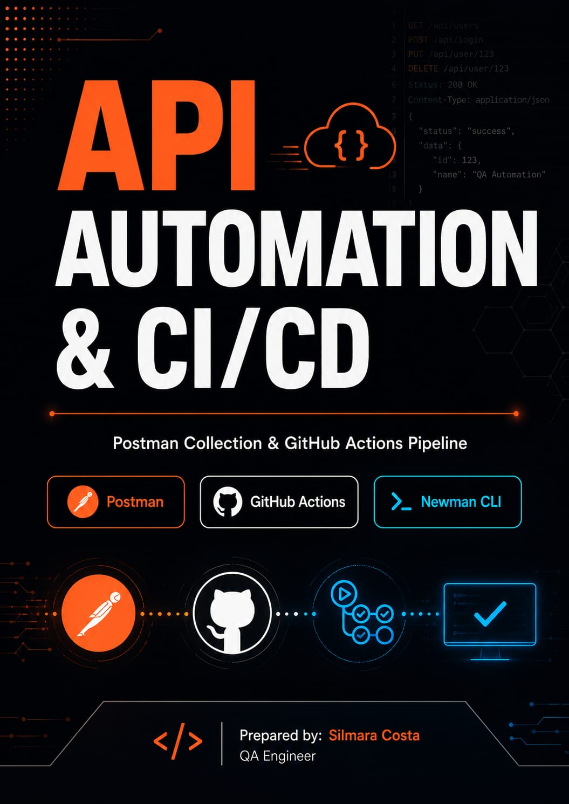
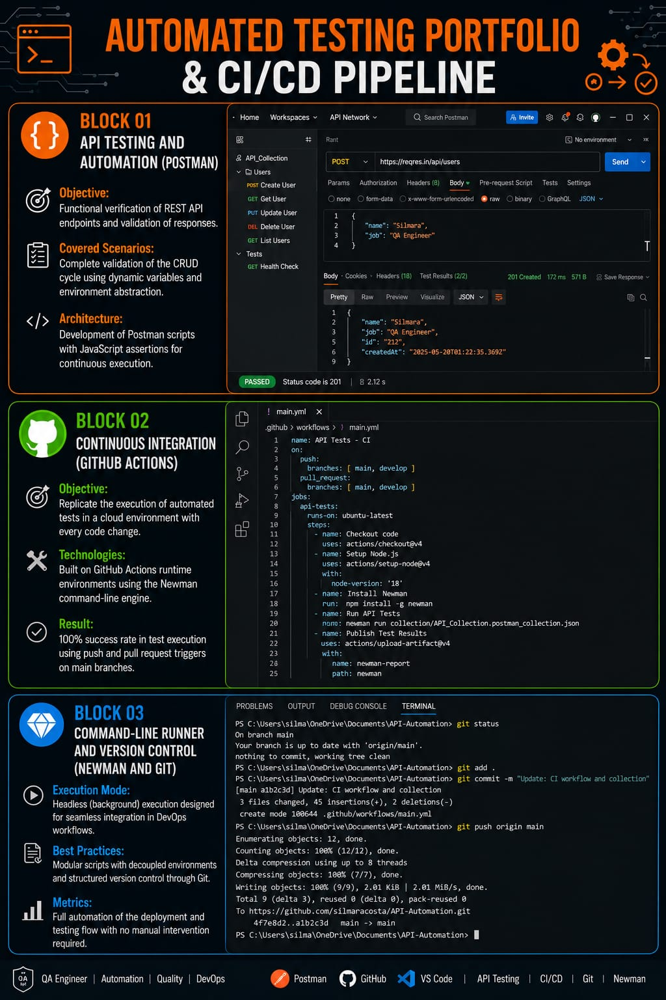

# 🌐 CI/CD Pipeline for API Test Automation (Postman + GitHub Actions)

This repository contains a comprehensive Continuous Integration (CI) infrastructure designed for headless automated testing to validate the behavior, contracts, and stability of a REST API using **Postman, Newman CLI, and GitHub Actions**.

The workflow ensures that every code change is rigorously tested in the cloud before hitting production environments.

---

## 🚀 Automation Suite Structure

### 01. API Testing & Automation (Postman)
*   **Objective:** Functional verification of REST API endpoints and strict response schema validation.
*   **Covered Scenarios:** Comprehensive validation of the CRUD lifecycle using dynamic variables and environment abstraction to maintain data consistency.
*   **Architecture:** Postman testing scripts with automated JavaScript assertions executed immediately upon receiving server responses.

### 02. Continuous Integration (GitHub Actions)
*   **Objective:** Replicate the execution of automated test suites in a cloud container with every code change, eliminating manual intervention.
*   **Technologies:** Pipeline built on GitHub Actions runners (`ubuntu-latest`) powered by the Newman CLI engine.
*   **Result:** 100% execution success rate triggered automatically by code pushes and pull requests to main branches (`main` and `develop`). The workflow also includes automated test report publishing via artifacts (`actions/upload-artifact`).

### 03. Command Line Runner & Version Control (Newman & Git)
*   **Execution Mode:** Headless and lightweight execution tailored for seamless and efficient integration into DevOps workflows.
*   **Best Practices:** Modular test scripts with completely decoupled environments and structured version control managed step-by-step through Git.
*   **Metrics:** Full automation of the deployment and testing flow, verifying API responses within milliseconds without manual triggers.

---

## 🛠️ Technologies & Tools

*   **API Target:** ReqRes API (User Management Services)
*   **API Testing Engine:** Postman / Newman CLI
*   **CI/CD Platform:** GitHub Actions
*   **Version Control:** Git
*   **Environment Runner:** Ubuntu Linux (Cloud Container)

---

## 📈 Technical Benefits Implemented

*   **Immediate Feedback:** Early detection of breaking changes in API contracts directly within the developer's commit lifecycle.
*   **Zero Manual Execution:** The suite is fully prepared to run autonomously in cloud infrastructure with every single commit.
*   **Report History:** Automatic generation of build artifacts containing detailed Newman execution summaries for quality audits.
