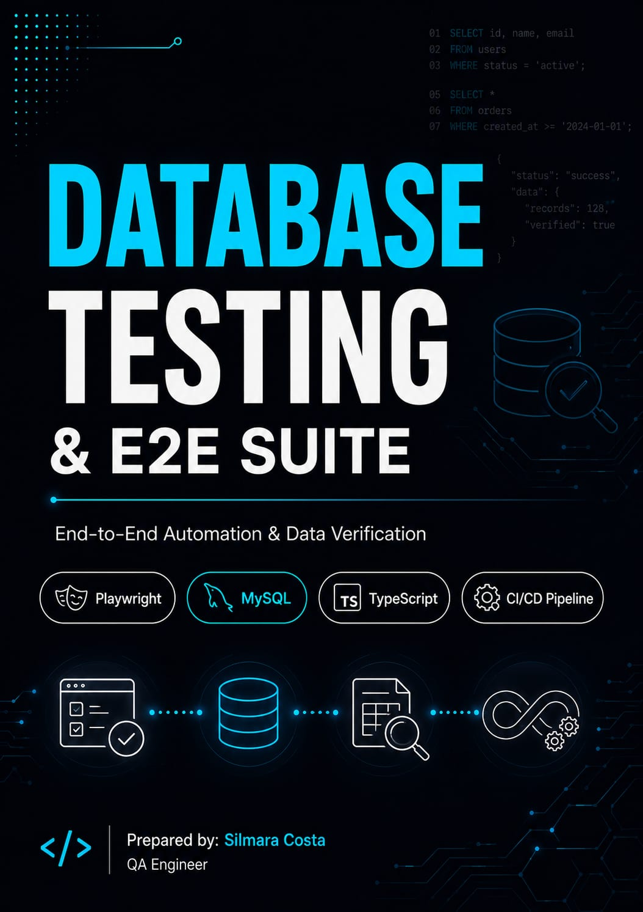
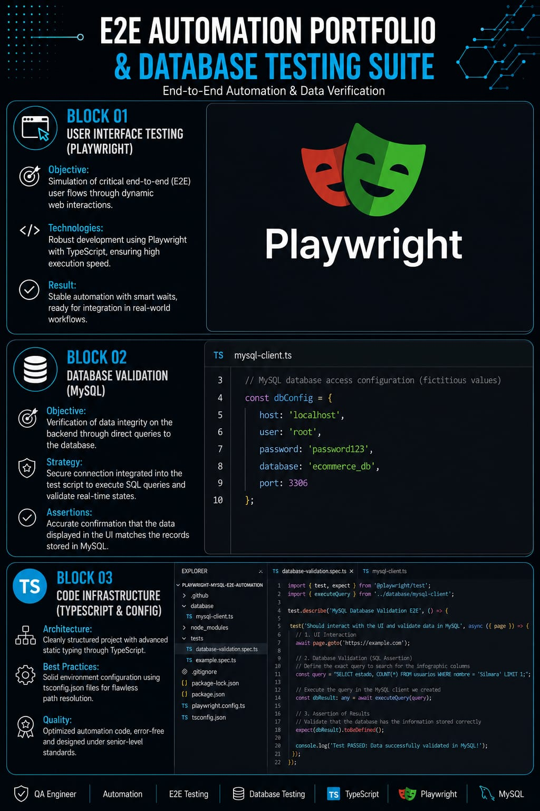

# 🗄️ Database Testing & Playwright E2E Automation Suite

This repository features a professional End-to-End (E2E) automation framework developed using **Playwright and TypeScript**, seamlessly integrated with a **MySQL** database. The primary goal of this project is to eliminate human error through backend automated data verification.

---

## 🚀 Project Architecture & Structure

### 01. User Interface Automation (Playwright)
*   **Objective:** Simulating critical user journeys and end-to-end flows through dynamic web interactions.
*   **Technologies:** Built with a robust TypeScript implementation, ensuring high execution speed and test stability.
*   **Result:** Reliable and resilient automation scripts featuring smart waits, fully prepared for deployment environments.

### 02. Database Validation (MySQL)
*   **Objective:** Verifying data integrity behind the scenes by running direct queries against the database.
*   **Strategy:** Secure database connections embedded into the test runner to execute SQL queries and validate states in real-time.
*   **Assertions:** Ensuring absolute alignment between the data displayed on the frontend UI and the records persisted in MySQL.

### 03. Code Infrastructure (TypeScript & Configuration)
*   **Architecture:** Clean project folder structure enforcing advanced static typing and strict coding standards.
*   **Best Practices:** Robust environment setup utilizing `tsconfig.json` files for seamless path resolution and module loading.
*   **Quality:** Optimized automation scripts, fully free of type errors and warnings, designed under senior-level engineering practices.

---

## 🛠️ Tech Stack & Tools

*   **Language:** TypeScript
*   **E2E Framework:** Playwright
*   **Database Engine:** MySQL
*   **Connection Driver:** `mysql2`

---

## 📈 Technical Benefits of this Architecture

*   **High Reliability:** Guarantees that user actions performed on screen correctly update data persistence backends.
*   **Data Independence:** Full control to seed, isolate, and clean up test data using SQL commands before and after test execution.
*   **Clean Code Standards:** Streamlined development environment with zero unhandled typing or configuration errors.
