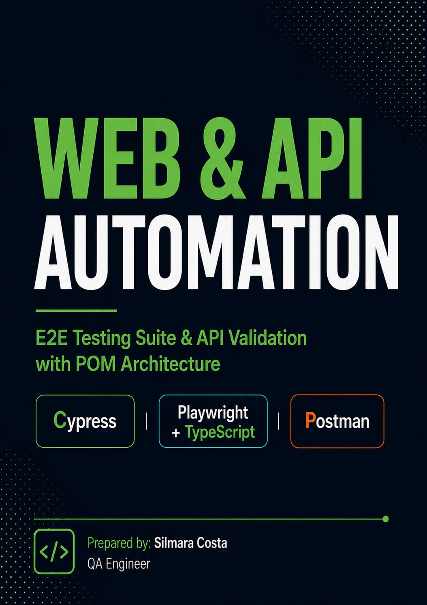
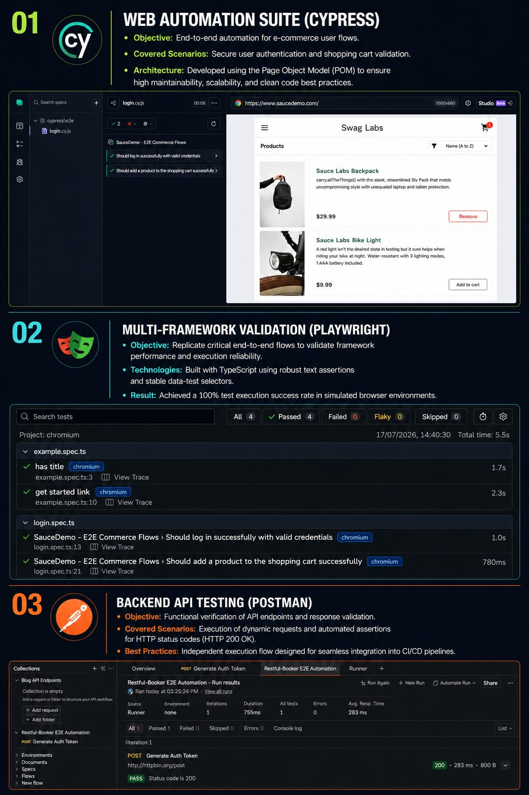

# 🌐 Multi-Framework E2E & API Testing Suite

This repository contains an advanced and unified automated testing suite designed to validate end-to-end (E2E) user journeys and backend API integrations. The project implements market-leading tools (*Cypress, Playwright, and Postman*) applying software architecture and design best practices for Quality Assurance.

---

## 🚀 Testing Suite Structure

### 01. Web Automation Suite (Cypress)
*   *Objective:* End-to-end automation for critical user flows on E-commerce platforms.
*   *Covered Scenarios:* Secure user authentication and dynamic shopping cart validations.
*   *Architecture:* Developed using the *Page Object Model (POM)* pattern to ensure high maintainability, scalability, and clean code.

### 02. Multi-Framework Validation (Playwright)
*   *Objective:* Replicate and validate critical E2E flows to compare agility, stability, and framework performance under parallel execution.
*   *Technologies:* Robust implementation in *TypeScript* using native text assertions and stable selectors based on test data (data-test).
*   *Result:* 100% execution success rate within isolated browser environments (Chromium).

### 03. Backend API Testing (Postman)
*   *Objective:* Rigorous functional verification of REST service endpoints and response integrity validation.
*   *Escenarios Cubiertos:* Sequential execution of dynamic requests, variable chaining, and automated assertions for HTTP status codes (200 OK, 201 Created).
*   *Best Practices:* Independent and decoupled execution flow, ideal for seamless integration into CI/CD pipelines.

---

## 🛠️ Technologies & Tools

*   *Languages:* JavaScript / TypeScript
*   *E2E Frameworks:* Cypress, Playwright
*   *API Testing:* Postman / Newman CLI
*   *Design Patterns:* Page Object Model (POM)

---

## 📈 Technical Project Benefits

*   *Error Mitigation:* Comprehensive coverage of critical business flows to prevent regressions.
*   *Robustness:* Smart wait strategies that eliminate flaky behavior in user interface tests.
*   *Living Documentation:* Test cases act as automated functional specifications of the application's expected behavior.
