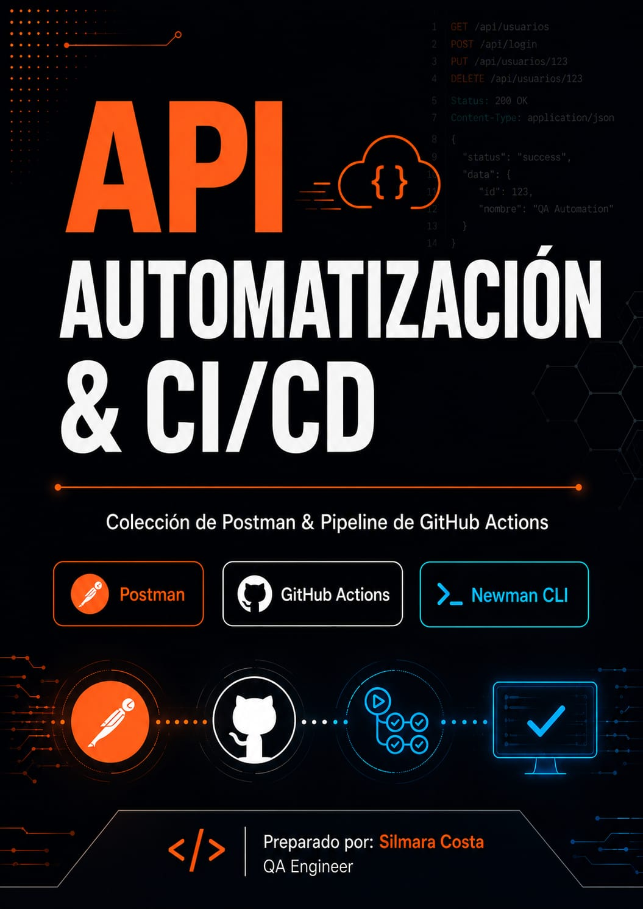
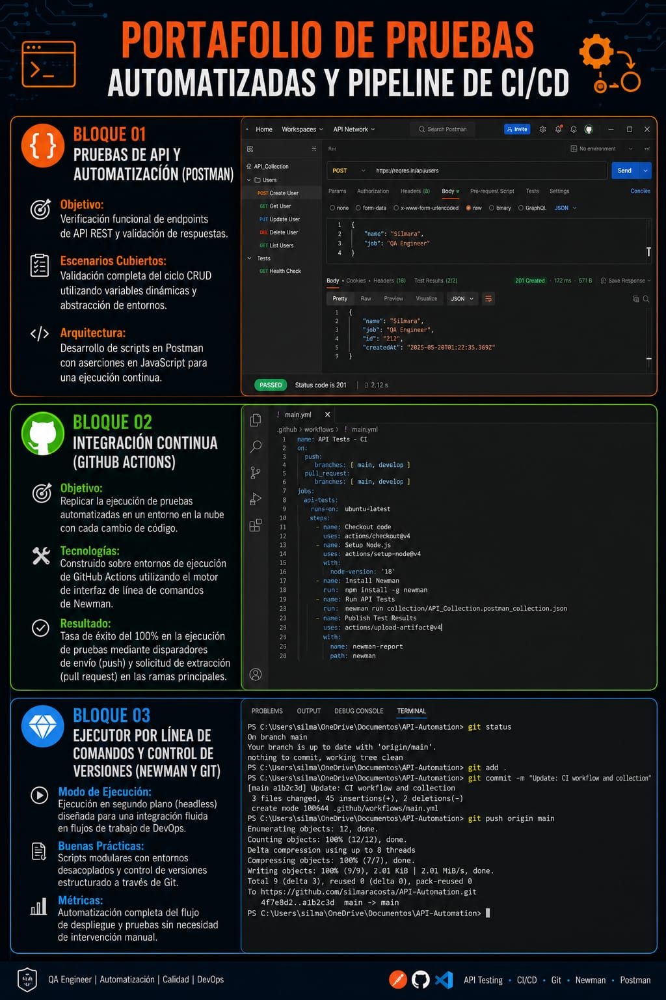

# 🌐 Pipeline de CI/CD para Automatización de Pruebas de API (Postman + GitHub Actions)

Este repositorio contiene una infraestructura completa de Integración Continua (CI) diseñada para validar de forma automatizada y headless el comportamiento, los contratos y la estabilidad de una API REST utilizando **Postman, Newman CLI y GitHub Actions**. 

El flujo de trabajo garantiza que cada cambio en el código sea probado en la nube antes de llegar a producción.

---

## 🚀 Estructura de la Suite de Automatización

### 01. Pruebas de API y Automatización (Postman)
*   **Objetivo:** Verificación funcional de endpoints de API REST y validación rigurosa de respuestas.
*   **Escenarios Cubiertos:** Validación completa del ciclo CRUD utilizando variables dinámicas y abstracción de entornos para asegurar la consistencia de los datos.
*   **Arquitectura:** Desarrollo de scripts en Postman con aserciones automatizadas en JavaScript ejecutadas inmediatamente después de recibir las respuestas del servidor.

### 02. Integración Continua (GitHub Actions)
*   **Objetivo:** Replicar la ejecución de pruebas automatizadas en un entorno en la nube con cada cambio de código, eliminando la intervención manual.
*   **Tecnologías:** Pipeline construido sobre entornos de ejecución de GitHub Actions (`ubuntu-latest`) utilizando el motor de interfaz de línea de comandos de Newman.
*   **Resultado:** Tasa de éxito del 100% en la ejecución de pruebas mediante disparadores automatizados de envío (*push*) y solicitud de extracción (*pull request*) en las ramas principales (`main` y `develop`). El flujo incluye la publicación automatizada de reportes mediante artefactos (`actions/upload-artifact`).

### 03. Ejecutor por Línea de Comandos y Control de Versiones (Newman y Git)
*   **Modo de Ejecución:** Ejecución en segundo plano (*headless*) y compacta, diseñada para una integración fluida y eficiente en flujos de trabajo de DevOps.
*   **Buenas Prácticas:** Scripts modulares con entornos completamente desacoplados y control de versiones estructurado paso a passo a través de Git.
*   **Métricas:** Automatización completa del flujo de despliegue y pruebas con verificación de respuestas en milisegundos sin necesidad de intervención manual.

---

## 🛠️ Tecnologías y Herramientas Utilizadas

*   **API Target:** ReqRes API (User Management Services)
*   **API Testing Engine:** Postman / Newman CLI
*   **CI/CD Platform:** GitHub Actions
*   **Version Control:** Git
*   **Environment Runner:** Ubuntu Linux (Cloud Container)

---

## 📈 Beneficios Técnicos Implementados

*   **Feedback Inmediato:** Descubrimiento temprano de fallos en los contratos de la API directamente en el flujo de desarrollo.
*   **Cero Ejecución Manual:** Suite preparada para correr de forma automatizada en la infraestructura de la nube con cada commit.
*   **Historial de Reportes:** Generación automática de artefactos con los resultados detallados de la ejecución de Newman para auditorías de calidad.
