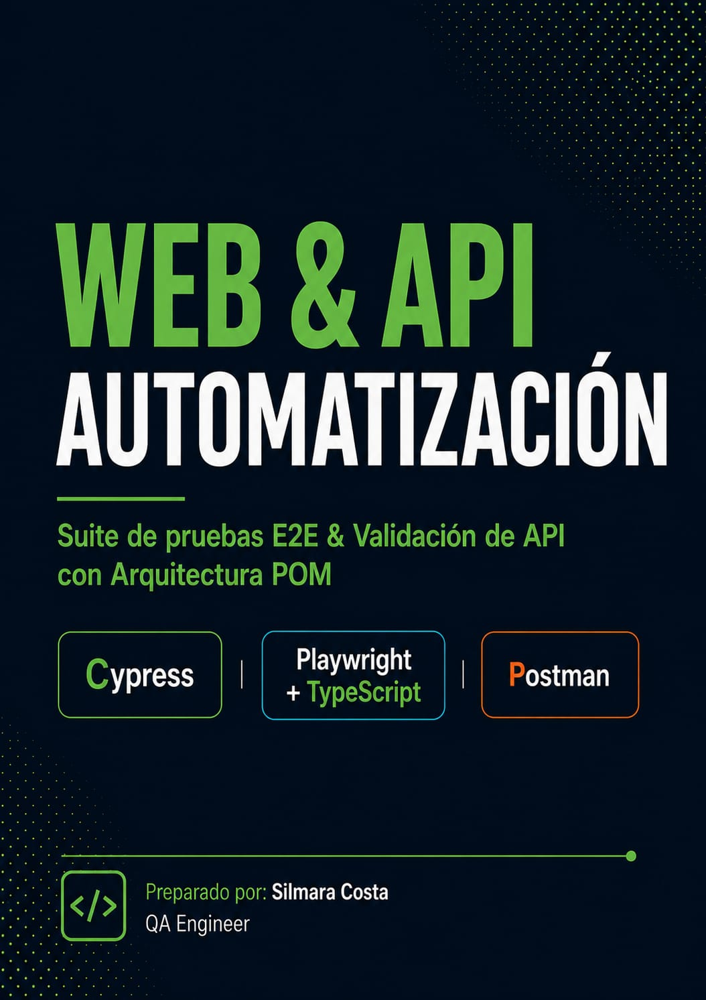
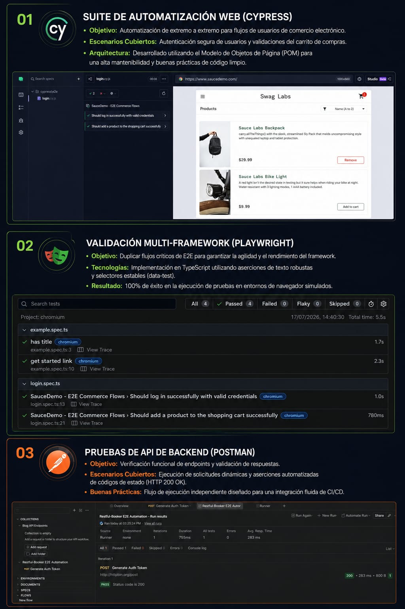

# 🌐 Suite de Automatización Multi-Framework E2E & Pruebas de API

Este repositorio contiene una suite de pruebas automatizadas avanzada y unificada, diseñada para validar flujos de extremo a extremo (E2E) e integraciones de API de backend. El proyecto implementa las herramientas líderes del mercado (*Cypress, Playwright y Postman*) aplicando las mejores prácticas de arquitectura y diseño de software para QA.

---

## 🚀 Estructura de la Suite de Pruebas

### 01. Suite de Automatización Web (Cypress)
*   *Objetivo:* Automatización de extremo a extremo para flujos de usuarios en plataformas de comercio electrónico (E-commerce).
*   *Escenarios Cubiertos:* Autenticación segura de usuarios y validaciones dinámicas del carrito de compras.
*   *Arquitectura:* Desarrollado utilizando el *Modelo de Objetos de Página (POM - Page Object Model)* para garantizar una alta mantenibilidad, escalabilidad y un código limpio.

### 02. Validación Multi-Framework (Playwright)
*   *Objetivo:* Replicar y validar flujos críticos de E2E para comparar la agilidad, estabilidad y el rendimiento del framework frente a ejecuciones masivas.
*   *Tecnologías:* Implanteación robusta en *TypeScript* utilizando aserciones de texto nativas y selectores estables basados en datos de prueba (data-test).
*   *Resultado:* 100% de éxito en la ejecución paralela dentro de entornos de navegador simulados (Chromium).

### 03. Pruebas de API de Backend (Postman)
*   *Objetivo:* Verificación funcional rigurosa de endpoints de servicios REST y validación de la integridad de las respuestas.
*   *Escenarios Cubiertos:* Ejecución secuencial de solicitudes dinámicas, encadenamiento de variables y aserciones automatizadas de códigos de estado (HTTP 200 OK, 201 Created).
*   *Buenas Prácticas:* Flujo de ejecución independiente y desacoplado, ideal para una integración fluida en pipelines de CI/CD.

---

## 🛠️ Tecnologías y Herramientas

*   *Lenguajes:* JavaScript / TypeScript
*   *Frameworks E2E:* Cypress, Playwright
*   *Pruebas de API:* Postman / Newman CLI
*   *Patrones de Diseño:* Page Object Model (POM)

---

## 📈 Beneficios Técnicos del Proyecto

*   *Mitigación de Errores:* Cobertura total de los flujos críticos de negocio para evitar regresiones.
*   *Robustez:* Uso de estrategias de espera inteligentes que eliminan el comportamiento inestable (flakiness) en las pruebas de interfaz de usuario.
*   *Documentación Viva:* Los casos de prueba sirven como especificación funcional automatizada del comportamiento esperado de la aplicación.
